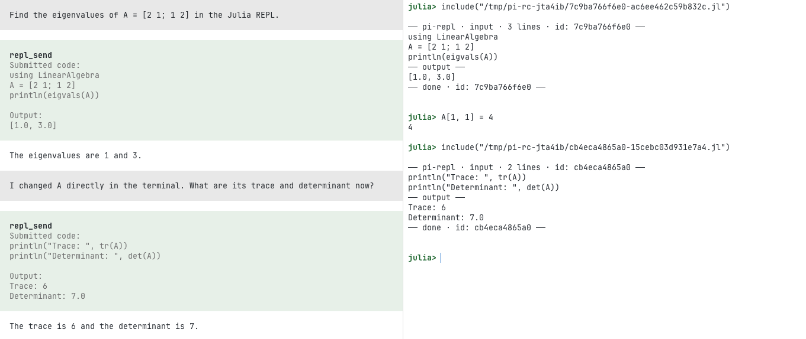

# pi-repl

Minimal [pi](https://github.com/badlogic/pi-mono) extension for collaborative REPL sessions using tmux.

`pi-repl` starts a shared Python, IPython, Julia, R, Haskell (GHCi), or Clojure REPL in tmux that you can attach to from another terminal window. You can work in the REPL directly, or ask pi to send and execute code there.



*Interacting with a shared Julia REPL.*

## Current scope

Currently, `pi-repl` supports **Python/IPython**, **Julia**, **R**, **Haskell (GHCi)**, and **Clojure**.

With `pi-repl` you can:

- start a shared REPL from pi
- attach to that REPL from another terminal window
- work in the REPL yourself as normal
- ask pi, in natural language, to run code in the shared Python/IPython, Julia, R, Haskell (GHCi), or Clojure REPL
- start, attach to, inspect, and stop a shared R REPL
- start, attach to, inspect, and stop a shared Haskell (GHCi) REPL
- start, attach to, inspect, and stop a shared Clojure REPL
- let pi read the raw shared REPL transcript for extra context when needed
- keep a bounded clean record of compatible-client submissions and captured output, synchronized automatically with a compatible `pi-studio` using the same tmux session
- optionally show bounded, request-specific submitted code and compact alignment anchors in the raw pane, with Off as the privacy-conscious default
- export that clean record as canonical Markdown
- check which shared REPL sessions are running
- inspect which Python interpreter and environment the shared Python/IPython REPL is using with `/repl env`
- stop the shared REPL when you are done

Use `/lab` as a short alias for `/repl`.

## Install

From npm:

```bash
pi install npm:pi-repl
```

From GitHub:

```bash
pi install https://github.com/omaclaren/pi-repl
```

Restart pi after installing.

## Commands

| Command | Description |
|---------|-------------|
| `/repl` | Show usage |
| `/lab` | Alias for `/repl` |
| `/repl python` | Start the shared Python/IPython session with `python` |
| `/repl ipython` | Start the shared Python/IPython session with `ipython` |
| `/repl julia` | Start the shared Julia session with `julia` |
| `/repl r` | Start the shared R session with `R` |
| `/repl ghci` | Start the shared Haskell (GHCi) session with `ghci` |
| `/repl clojure` | Start the shared Clojure session with `clojure` |
| `/lab python` | Same as `/repl python` |
| `/lab ipython` | Same as `/repl ipython` |
| `/lab julia` | Same as `/repl julia` |
| `/lab r` | Same as `/repl r` |
| `/lab ghci` | Same as `/repl ghci` |
| `/lab clojure` | Same as `/repl clojure` |
| `/repl echo` | Show the current submitted-code pane-echo mode |
| `/repl echo off` | Disable submitted-code displays and raw-history anchors for new sends (default) |
| `/repl echo summary` | Show short submissions in full, truncating after 6 lines or 600 source characters, with compact anchors |
| `/repl echo full` | Show up to 40 lines or 4,000 source characters and anchors in persistent raw history |
| `/repl status` | Show running shared REPL sessions |
| `/repl status python` | Show status for the shared Python/IPython session |
| `/repl status julia` | Show status for the shared Julia session |
| `/repl status r` | Show status for the shared R session |
| `/repl status ghci` | Show status for the shared Haskell (GHCi) session |
| `/repl status clojure` | Show status for the shared Clojure session |
| `/repl env` | Show which interpreter and environment the shared Python/IPython REPL is using |
| `/repl attach` | Show how to attach from a new terminal window |
| `/repl attach julia` | Show how to attach to the shared Julia session |
| `/repl attach r` | Show how to attach to the shared R session |
| `/repl attach ghci` | Show how to attach to the shared Haskell (GHCi) session |
| `/repl attach clojure` | Show how to attach to the shared Clojure session |
| `/repl export` | Export the clean record when exactly one shared session is running |
| `/repl export python` | Export the shared Python/IPython clean record as canonical Markdown |
| `/repl export julia` | Export the shared Julia clean record as canonical Markdown |
| `/repl export r` | Export the shared R clean record as canonical Markdown |
| `/repl export ghci` | Export the shared Haskell (GHCi) clean record as canonical Markdown |
| `/repl export clojure` | Export the shared Clojure clean record as canonical Markdown |
| `/repl stop` | Stop the shared session if only one is running |
| `/repl stop python` | Stop the shared Python/IPython session |
| `/repl stop julia` | Stop the shared Julia session |
| `/repl stop r` | Stop the shared R session |
| `/repl stop ghci` | Stop the shared Haskell (GHCi) session |
| `/repl stop clojure` | Stop the shared Clojure session |

For R, both `/repl R` and `/repl r` work. The same applies to `/lab`, `/repl status`, `/repl attach`, `/repl export`, and `/repl stop`.

For Clojure, `/repl clojure` is canonical and `/repl clj` also works. The same applies to `/lab`, `/repl status`, `/repl attach`, `/repl export`, and `/repl stop`.

## Tools used by pi

`pi-repl` also exposes tools that pi can use internally. In normal use, you can just ask pi to run code in the shared REPL or use the `/repl` commands directly.

| Tool | Description |
|------|-------------|
| `repl_status` | Inspect shared Python/IPython, Julia, R, Haskell (GHCi), and Clojure REPL state |
| `repl_send` | Execute code in the running shared Python/IPython, Julia, R, Haskell (GHCi), or Clojure session |

Notes:

- `repl_status` is what pi uses to check which shared REPL sessions are currently running
- while a shared REPL is running, `repl_status` exposes the versioned clean-record ID/path/count/tail and the separate raw session history path
- pi can use the clean entries when it needs compatible-client code/output boundaries, or read the raw history for context about direct pane interaction
- the relevant shared session must already be running before `repl_send`
- you can ask pi naturally to run code in Python, IPython, Julia, R, Haskell, or Clojure; pi chooses the tool parameters internally
- for plain Python, `print(...)` is the safest way to get values back reliably
- in Haskell (GHCi), use normal interactive syntax such as `let` bindings or `:{ ... :}` blocks for multiline declarations
- in Clojure, use normal interactive syntax such as `let`, `def`/`defn`, or `do` forms for multiline code
- tool output includes both the submitted code and the captured output
- `repl_send` accepts `echoMode: off|summary|full` for a single send; otherwise it uses `/repl echo`, initialized from `PI_REPL_ECHO_MODE` or Off
- Full echo mode writes bounded submitted source code into persistent raw terminal history; Summary shows short submissions in full and truncates after 6 lines or 600 source characters

## Shared clean record

`pi-repl` remains independently usable and has no dependency on `pi-studio`. When a compatible `pi-studio` uses the same tmux REPL session, both clients automatically discover one session-owned clean record and see each other's submitted code and captured output.

Compatible clients publish a versioned opaque ID in tmux and store the bounded JSON snapshot in a private per-user temporary directory. The record is tied to the exact tmux session ID and creation time, uses atomic locked updates, and holds a shared send lease from pre-send capture through completion capture. If `repl_send` times out or is aborted after submission, that live client retains the lease until the runtime completion signal appears or the exact tmux session ends; caller cancellation does not stop code already running in the REPL. This serializes compatible Studio and `pi-repl` sends so they do not claim each other's output.

The clean record does **not** infer semantic boundaries for commands typed directly into an attached tmux pane. Direct interaction remains in the raw pane/history mirror. `/repl export [target]` writes the canonical clean-record Markdown to a new no-clobber file in Pi's current working directory; its metadata identifies entry origin, mode, status, runtime, and timestamp and states the direct-input limitation.

Existing sessions attach lazily. Unsupported versions and invalid or stale session identities are left untouched, with ordinary `pi-repl` behavior and raw history still available. See [`shared/REPL_SESSION_RECORD_PROTOCOL.md`](./shared/REPL_SESSION_RECORD_PROTOCOL.md) for protocol, safety, retention, and compatibility details.

### Submission display and alignment anchors

Optional pane echo places submitted code after a compact begin anchor, followed by a plain `── output ──` divider and a completion anchor. The anchors contain a stable 12-character hash derived from the Shared REPL Record entry ID, allowing known sends to be aligned in future derived transcripts without exposing the entry ID itself. `repl_send` removes the exact header, source preview, divider, and footer from captured output and the clean record, while they remain in raw pane history.

Use `/repl echo off|summary|full` to change the default for the current Pi process, or set `PI_REPL_ECHO_MODE` before startup. A per-send `echoMode` overrides that default. **Off** is the startup default and emits no optional display or alignment anchors, although the REPL can still echo its unavoidable temporary-file control command. **Summary** shows short submissions in full, truncates after 6 lines or 600 source characters, and puts a plain output divider before runtime output. **Full** raises those bounds to 40 lines or 4,000 source characters and therefore persists more source code in raw terminal history. Terminal, line-separator, and bidirectional control characters are escaped in all visible previews.

Runtime wrappers use compact request-unique paths such as `/tmp/pi-rc-<user-key>/<token>.py` instead of fixed global files such as `/tmp/pr.py`. The per-user root is current-user-owned mode `0700`, source files are mode `0600`, and files are removed after capture or by the timeout/abort watcher once execution settles. The short command remains readable while separate Pi processes, tmux servers, runtimes, and Studio sends cannot overwrite one another's control files.

These anchors are presentation and alignment evidence only. They do not make direct attached-pane input authoritative and never promote inferred raw history into protocol-v1 entries.

## Shared sessions

The default shared tmux session names are:

- `pi-repl-python` for Python/IPython
- `pi-repl-julia` for Julia
- `pi-repl-r` for R
- `pi-repl-ghci` for Haskell (GHCi)
- `pi-repl-clojure` for Clojure

The Python/IPython session can currently be launched in either:

- `python` mode
- `ipython` mode

## Attaching

After running `/repl attach`, open a new terminal window and run the tmux command shown by pi. For example:

```bash
tmux attach -t pi-repl-python
```

## Example workflow

```text
/repl ipython
/repl env
/repl echo summary
/repl status
/repl attach

/repl julia
/repl status julia
/repl attach julia

/repl R
/repl status r
/repl attach r

/repl ghci
/repl status ghci
/repl attach ghci

/repl clojure
/repl status clojure
/repl attach clojure

/repl export python
```

Example requests once the REPL is running:

- `run print(sys.executable) in the shared Python REPL`
- `inspect the current globals in the shared Python REPL`
- `in the shared Julia REPL, load LinearAlgebra`
- `now find the eigenvalues of [2 1; 1 2] in the shared Julia REPL`
- `in the shared R REPL, run mean(c(1, 2, 3, 4))`
- `in the shared Haskell REPL, run map (+1) [1,2,3]`
- `in the shared Clojure REPL, run (map inc [1 2 3])`

## Notes

- `tmux` is required.
- While a shared REPL is running, `pi-repl` keeps both the compatible-client clean record and a raw transcript log of the tmux pane output for that session.
- The raw transcript is plain text and may include prompts, echoed input, request-specific display anchors, output, direct pane interaction, and errors; it is not parsed into clean entries.
- `/repl env` is currently implemented for Python/IPython only.

## Related extensions

[`pi-interactive-shell`](https://github.com/nicobailon/pi-interactive-shell) offers related but distinct functionality for interactive CLI sessions in pi, including overlay-based interaction and user take-over. `pi-repl` is focused specifically on shared tmux-backed REPL sessions.

## License

MIT
